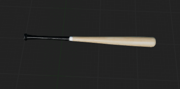
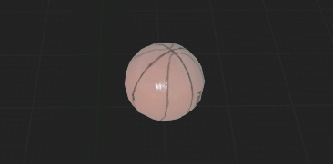
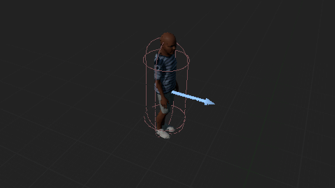
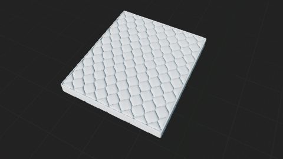
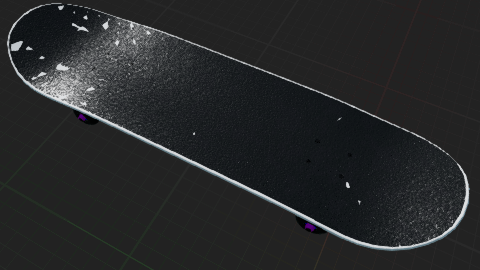
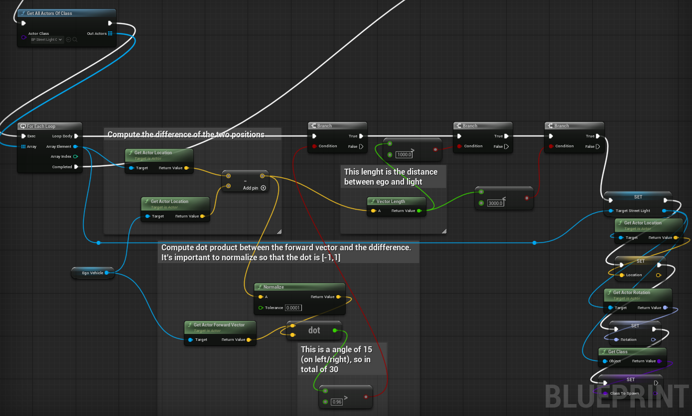
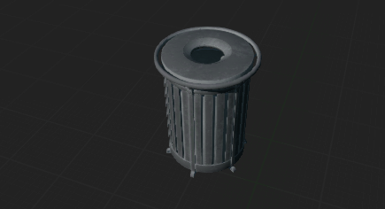
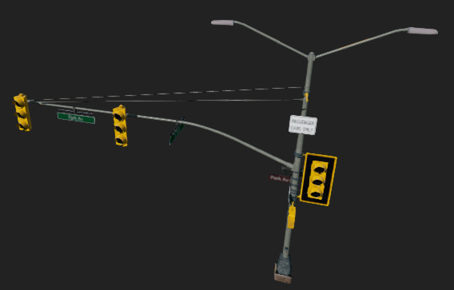
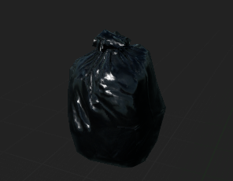
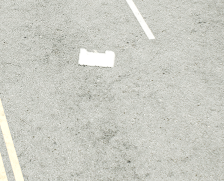

# C++
I’ve made some modifications to the C++ source code of Carla. Here’s a list:
### MakeBlueprintDefinition() in ActorBlueprintFunctionLibrary.cpp
When a Blueprint is spawned, the class (of the blueprint) was not loaded, so I modified the code in order to load the class.
### Added a new Python API function that allows to change the semantic tag of the actors dynamically (set_actor_semantic_tag)
Here’s how it works.
1. Add the function in the Actor.cpp (In the PythonAPI folder) in a .def format
2. This calls SetActorSemanticTag() placed in Simulator.h, which has a reference to a Client instance, and uses it to call SetActorSemanticTag() placed in Client.cpp
3. The Client is used to communicate with the server through some “messages", in this case the Client sends a message containing: set_actor_semantic_tag, the actor ID and the new Tag.
4. The Server (CarlaServer.cpp) has a binding between the message set_actor_semantic_tag and a function that calls SetSemanticTag placed in CarlaActor.cpp, which call SetActorTag in Tagger.cpp 
### Add a new python API function to retag the actor to the original semantic tag(s)
Same as above, but the CarlaServer.cpp calls direction ATagger::TagActor()
### Adding a new semantic tag
Work flow (the first four steps are the explained in the documentation https://carla.readthedocs.io/en/latest/tuto_D_create_semantic_tags/#1-create-the-tag-id):
1. Add the tag to ObjectLabel.h 
2. Create the folder with that name in Carla/Static
3. Modify the following functions in Tagger.cpp
   - GetLabelByFolderName() : add the new tag to the switch
   - GetTagAsString() : add the new tag to the switch
   - GetTagFromString() : add the new tag to the switch
4. Define the color in CityscapesPalette.h 
5. In PythonAPI/carla/src/Actor.cpp, modify the function GetTagFromString() to return the new tag when the string is passed, this should be the same as GetTagFromString() in Tagger.cpp
# Python
### Main.py
This file contains all the logic for connecting to the Carla server, spawning objects, and the for-loop simulation. The simulation starts with the mustang as an ego vehicle, some other vehicles and some pedestrians. If specified, anomalies are spawned. The simulation can stop for three main causes:
1. Ego vehicle collides with an anomaly
2. Ego vehicle surpass the last anomaly
3. The simulation time is reached
The main can be launched with this command: python main.py and there are several arguments. Here’s a table describing them:

|         Argument          | Description                                                                                                                                                                                           | Default Value |
|:-------------------------:|-------------------------------------------------------------------------------------------------------------------------------------------------------------------------------------------------------|---------------|
|        -h, --help         | Show help message and exit                                                                                                                                                                            | -             |
|          --seed           | Seed for the random number generator                                                                                                                                                                  | 42            |
|   --numeber_of_vehicles   | Number of vehicles to spawn for each simulation                                                                                                                                                       | 10            |
| --number_of_pedestrians   | Number of pedestrians to spawn for each simulation                                                                                                                                                    | 10            |
|         --filterv         | The filter used to spawn the vehicles, this doesn’t affect the ego vehicle, which is always the mustang                                                                                               | vehicle.*     |
|         --filterw         | The filter used to spawn the pedestrians                                                                                                                                                              | walker.*      |
|         --hybrid          | If enabled, physics is only computed for a certain radius with center in the ego vehicle (more computational efficiency). A vehicle far from the ego vehicle doesn’t move smoothly, but is teleported | -             |
|      --image_size_x       | Width of the camera image (for rgb, semantic, instance and depth camers)                                                                                                                              | 800           |
|      --image_size_y       | Height of the camera image (for rgb, semantic, instance and depth camers)                                                                                                                             | 600           |
|           --rgb           | If enabled, the rgb camera is spawned                                                                                                                                                                 | -             |
|        --semantic         | If enabled, the semantic camera is spawned                                                                                                                                                            | -             |
|        --instance         | If enabled, the instance camera is spawned                                                                                                                                                            | -             |
|          --depth          | If enabled, the depth camera is spawned                                                                                                                                                               | -             |
|     --lidar_semantic      | If enabled, the semantic lidar is spawned                                                                                                                                                             | -             |
|          --lidar          | If enabled, the lidar is spawned                                                                                                                                                                      | -             |
|          --radar          | If enabled, the radar is spawned                                                                                                                                                                      | -             |
|     --number_of_runs      | Number of runs to perform, each run is a simulation with the same parameters                                                                                                                          | 1             |
|        --run_time         | Time in seconds for each run, after this time the simulation stops                                                                                                                                    | 10            |
|        --anomalies        | List of anomalies to spawn, separated by spaces                                                                                                                                                       | None          |   
|           --fps           | The number of FPS the simulation should run at                                                                                                                                                        | 20            |
|       --sensor_tick       | The time in seconds betweeen two sensor data captures. For example if we want to capture at 10 FPS, the sensor tick is 1 sec / 10 = 0.1. Note that this in uncorrelated to the FPS of the simulation  | 0.1           |
#### Functions: 

`handle_sensor_data(args, run, sensors)`, calls the handle method for each sensor spawned in the simulation, which is present in `sensors`

`set_up_sensors(args, client,ego_vehicle,sensors,world)` , based on the sensors present in `args`, spawns the sensor and attaches it to `ego_vehicle` and inserts the spawned sensor in the `sensors` array

`generate_anomaly_object(world, client, ego_vehicle, name, distance, where, direction, anomaly_in_waypoint)`, creates the anomaly object based on the `name`

### anomalies.py
This file contains the definition of the anomalies that can be spawned in the simulation. Each anomaly is a class that inherits from `Anomaly`, which has a `spawn_anomaly()` method that spawns the anomaly in the world.
The anomalies are spawned in front of the ego vehicle with a random distance in a range of 10 to 20 meters, and the `Static anomalies` such as Football, Basketbal and Baseball bat have also a random direction (left/right)
in a range of -6 to 6 meters (with the ego vehicle in the center). The `Dynamic anomalies` such as Labrador, Person and Tree are spawned on the sidewalk, on the right of the ego vehicle.
The anomalies have to implement the `handle_semantic_tag(self)` method:
- `Labrador_Anomaly`: Spawns a Labrador dog in the world, that runs towards the ego vehicle in a random direction .
  - `handle_semantic_tag(self)` : Sets the semantic tag of the Labrador from `Animal` to `Anomaly` when the dog is getting close to the street.
  - 
- `Baseballbat_Anomaly`: Spawns a baseball bat in the world, that is placed on the ground, in front of the ego vehicle.
  - `handle_semantic_tag(self)` : Nothing, the semantic tag is `Anomaly` by default.
  - 
- `Basketball_Anomaly`: Spawns a basketball in the world, that is placed on the ground, in front of the ego vehicle.
  - `handle_semantic_tag(self)` : Nothing, the semantic tag is `Anomaly` by default.
  - 
- `Person_Anomaly`: Spawns a person in the world, that starts running on the sidewalk and then runs towards the ego vehicle in a random direction.
  - `handle_semantic_tag(self)` : Sets the semantic tag of the person from `Pedestrian` to `Anomaly` when the person is getting close to the street.
  - 
- `Tree_Anomaly`: Spawns a tree in the world, that starts falling when the ego vehicle is close to it.
  - `handle_semantic_tag(self)` : Sets the semantic tag of the tree from `Vegetation` to `Anomaly` when the tree is falling.
  - 
- `Beer_Anomaly`: Spawns a beer can in the world, that is placed on the ground, in front of the ego vehicle.
  - `handle_semantic_tag(self)` : Nothing, the semantic tag is `Anomaly` by default.
  - 
- `Football_Anomaly`: Spawns a football in the world, that is placed on the ground, in front of the ego vehicle.
  - `handle_semantic_tag(self)` : Nothing, the semantic tag is `Anomaly` by default.
  - 
- `Ladder_Anomaly`: Spawns a ladder in the world, that is placed on the ground, in front of the ego vehicle.
  - `handle_semantic_tag(self)` : Nothing, the semantic tag is `Anomaly` by default.
  - 
- `Mattress_Anomaly`: Spawns a mattress in the world, that is placed on the ground, in front of the ego vehicle.
  - `handle_semantic_tag(self)` : Nothing, the semantic tag is `Anomaly` by default.
  - 
- `Skateboard_Anomaly`: Spawns a skateboard in the world, that is placed on the ground, in front of the ego vehicle.
  - `handle_semantic_tag(self)` : Nothing, the semantic tag is `Anomaly` by default.
  - 
- `Tire_Anomaly`: Spawns a tire in the world, that is placed on the ground, in front of the ego vehicle.
  - `handle_semantic_tag(self)` : Nothing, the semantic tag is `Anomaly` by default.
  - 
- `WoodPalette_Anomaly`: Spawns a wooden palette in the world, that is placed on the ground, in front of the ego vehicle.
  - `handle_semantic_tag(self)` : Nothing, the semantic tag is `Anomaly` by default.
  - 
- `Basketball_Bounce_Anomaly`: Spawns a basketball that bounces in front of the ego vehicle.
  - `handle_semantic_tag(self)` : Nothing, the semantic tag is `Anomaly` by default.
  - 
- `Football_Bounce_Anomaly`: Spawns a football that bounces in front of the ego vehicle.
  - `handle_semantic_tag(self)` : Nothing, the semantic tag is `Anomaly` by default.
  - 
- `Streetlight_Anomaly`: Spawns a streetlight that is supposed to fall when the ego vehicle is close to it.
  - With this anomaly, the spawning is a bit different, as it is spawned as a replacement with an already existing streetlight in the world. All this modifications are done in the blueprint code.
  The idea is to take a street light that is in front of the ego vehicle in a range of 10 meters to 30 meters, move it to the coordinate (0,0,0), make it invisible and replace it with a new streetlight 
  that has the `Anomaly` semantic tag.
  The streetlight to be replaced is chosen between the ones that are in a angle of 30° in front of the ego vehicle.
  Once the simulation ends, the original streetlight is restored.
  If no streetlight is found, the simulation ends (only if no other anomalies are present).
  Here's the screenshot of the blueprint part that handles the computation of the streetlight to replace:
  
  - `handle_semantic_tag(self)` : Sets the semantic tag of the streetlight from `Nothing` to `Anomaly` when the streetlight is falling.
  - 
- `Trashcan_Anomaly`: Spawns a trashcan in the world, that is placed on the ground, on the right side of the ego vehicle, that is supposed to simulate
an impulse generated by wind.
  - `handle_semantic_tag(self)` : Sets the semantic tag of the trashcan from `Static` to `Anomaly` when the trashcan is near the street.
  - 
- `TrafficLight_Anomaly`: Checks if there is a traffic light in front of the ego vehicle (exactly as for the streetlight), and if so, makes it fall.
  - `handle_semantic_tag(self)` : Sets the semantic tag of the streetlight from `TrafficLight` to `Anomaly` when the streetlight is falling.
  - 
- `FlippedCar_Anomaly`: Spawns a car that is flipped in front of the ego vehicle. Everything is done in python, the blueprints used are 
the vehicle blueprints, so the car is spawned as a normal vehicle, flipped and then the `Anomaly` semantic tag is set. The ego vehicle
will ignore the flipped car, so it won't stop and will crash into it if in the way.
  - `handle_semantic_tag(self)` : Doesn't do anything, the semantic tag is `Anomaly` by default.
  - 
  - NOTE: The image is just for illustration, any vehicle can be used.
- `InstantCarBreak_Anomaly`: Spawns a car that stops instantly in front of the ego vehicle. Everything is done in python. First a vehicle in front
of the ego vehicle is chosen and if present, the vehicle is stopped.
  - `handle_semantic_tag(self)` : If a certain time has passed, the vehicle is stopped and set to `Anomaly` semantic tag.
- `TrafficLightOff_Anomaly`: If there is a traffic light in front of the ego vehicle, it is turned off.
  - `handle_semantic_tag(self)` : Sets the semantic tag of the traffic light from `TrafficLight` to `Anomaly` when the traffic light is turned off. Note
  that if a vehicle cross the intersection when the traffic light is turned off, it will not stop, so it is also marked as `Anomaly`.
  - 
- `CarThroughRedLight_Anomaly`: If there is a traffic light group in front of the ego vehicle, make the traffic light in front of the ego vehicle green and all the other red. Then select one among the 
red traffic light and take the first vehicle that is waiting and make it cross the intersection.
  - `handle_semantic_tag(self)` : Sets the semantic tag of the vehicle that crosses the intersection from `Vehicle` to `Anomaly`.
- `RoadSignTwisted_Anomaly`: If there's a road sign (Stop sign or Yield sign and all other traffic sign, that inherits from TrafficSignBase), in front of the ego vehicle, it is twisted randomly.
    - `handle_semantic_tag(self)` : Sets the semantic tag of the road sign from `RoadSign` to `Anomaly` when the road sign is twisted.
    - 
- `RoadSignVandalized_Anomaly`: If there's a road sign (Right Now only stop signs) in front of the ego vehicle, it is replace with a vandalized version.
    - `handle_semantic_tag(self)` : Sets the semantic tag of the road sign from `RoadSign` to `Anomaly` when the road sign is vandalized.
    - 
- `GarbageBag_Anomaly`: Spawns a garbage bag in the world, that is placed on the ground, in front of the ego vehicle.
  - `handle_semantic_tag(self)` : Nothing, the semantic tag is `Anomaly` by default.
  - 
- `GarbageBagWind_Anomaly`: Spawns a garbage bag in the world, that is placed on the ground, in front of the ego vehicle, that is supposed to simulate
an impulse generated by wind.
  - `handle_semantic_tag(self)` : Nothing, the samantic tag is `Anomaly` by default.
  - 
- `BrockenChair_Anomaly`: Spawns a broken chair in the world, that is placed on the ground, in front of the ego vehicle.
  - `handle_semantic_tag(self)` : Nothing, the semantic tag is `Anomaly` by default.
  - 
- `Bikes_Anomaly`: Spawns three bikes in the world, that is placed on the ground, in front of the ego vehicle.
  - `handle_semantic_tag(self)` : Nothing, the semantic tag is `Anomaly` by default.
  - 
- `Hubcap_Anomaly`: Spawns a hubcap in the world, that is placed on the ground, in front of the ego vehicle.
  - `handle_semantic_tag(self)` : Nothing, the semantic tag is `Anomaly` by default.
  - 
- `Newspaper_Anomaly`: Spawns two newspapers in the world, that is placed on the ground, in front of the ego vehicle.
  - `handle_semantic_tag(self)` : Nothing, the semantic tag is `Anomaly` by default.
  - 
- `BlowingNewspaper_Anomaly`: Spawns a newspaper in the world, that is placed on the ground, in front of the ego vehicle, that is supposed to simulate
an impulse generated by wind.
  - `handle_semantic_tag(self)` : Nothing, the semantic tag is `Anomaly` by default.
  - 
- `Box_Anomaly`: Spawns a box in the world, that is placed on the ground, in front of the ego vehicle.
  - `handle_semantic_tag(self)` : Nothing, the semantic tag is `Anomaly` by default.
  - 
- `PlasticBottle_Anomaly`: Spawns a plastic bottle in the world, that is placed on the ground, in front of the ego vehicle.
  - `handle_semantic_tag(self)` : Nothing, the semantic tag is `Anomaly` by default.
  - 
- `MetalBottle_Anomaly`: Spawns a metal bottle in the world, that is placed on the ground, in front of the ego vehicle.
  - `handle_semantic_tag(self)` : Nothing, the semantic tag is `Anomaly` by default.
  - 
- `WineBottle_Anomaly`: Spawns two wine bottles in the world, that is placed on the ground, in front of the ego vehicle.
  - `handle_semantic_tag(self)` : Nothing, the semantic tag is `Anomaly` by default.
  - 
- `Table_Anomaly`: Spawns a table in the world, that is placed on the ground, in front of the ego vehicle.
  - `handle_semantic_tag(self)` : Nothing, the semantic tag is `Anomaly` by default.
  - 
- `OfficeChair_Anomaly`: Spawns an office chair in the world, that is placed on the ground, in front of the ego vehicle.
  - `handle_semantic_tag(self)` : Nothing, the semantic tag is `Anomaly` by default.
  - 
### sensors.py
This file contains the definition of the sensors that can be spawned in the simulation. Each sensor is a class that inherits from `Sensor`, which has a `handle()` method that handles the data received from the sensor. 
The sensors are spawned in the world and attached to the ego vehicle:
- `RGB_Sensor`: Spawns an RGB camera that captures the scene in front of the ego vehicle.
  - `handle(self, data)`: Saves the image received from the camera to the `output/rgb` folder.
