# Dynamic Anomalies
In this document, we will explore how to add a dynamic anomaly in Carla Simulator and which anomalies are currently implemented.
## Adding a Dynamic Anomaly
The steps for adding a dynamic anomaly are equal to the steps for adding a static anomaly. The only difference is that when we import a character
anomaly, such as a kid running across the street, we need to create a Character blueprint and set the **Skeletal mesh**, not the **Static mesh**.
If the character also has some animations, we may need to create a blendspace (1D or 2D), that is used to change the animation based
on some variables. For example, if we want to create a kid running across the street, we can create a 1D blendspace that changes the animation based on the speed of the character.
Then we have to create the Animation Blueprint, that will update the variables of the Blendspace, and link the blueprint to the animation blueprint.
## Implementing Anomalies in Code
As for static anomalies, we need to create a class that inherits from Anomaly and implement the methods:
- `handle_semantic_tag()`: This method is responsible for handling the semantic tag of the anomaly. It can modify the semantic tag based on certain conditions or rules.
- `spawn_anomaly()`: This method is responsible for spawning the anomaly in the simulation. This method relies on the `spawn_anomaly()` method in 
utils.py. In case of dynamic anomalies, the only thing that changes is that the anomaly is rotated only on the yaw axis. 
## Currently Implemented Dymanic Anomalies
Here's a list of the already implemented static anomalies in Carla Simulator. For each anomaly there is a brief description of its spawn method/parameters, 
the handle_semantic_tag method and a picture (if available).
Total number of dynamic anomalies is 18. 

| Anomaly             | Spawn Method/Parameters                                                                                                                                                                    | Handle Semantic Tag / Event Tick of Blueprint                                                                                                      | Picture                                          |
|---------------------|--------------------------------------------------------------------------------------------------------------------------------------------------------------------------------------------|----------------------------------------------------------------------------------------------------------------------------------------------------|--------------------------------------------------|
| Labrador            | Spawns a labrador dog on the sidewalk that uses animations thanks to a blendspace based on velocity of the actor and starts running in random direction in front of the ego vehicle        | When the anomaly gets close to the road the anomaly is changed from "Aniaml" to "Dynamic_Anomaly"                                                  | 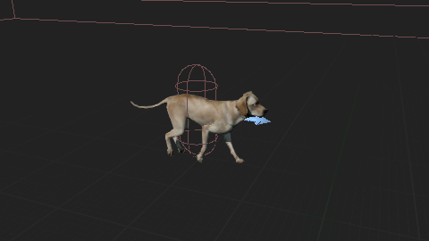                 |
| Person              | Spawn a person (kid) on the sidewalk that uses animations thanks to a blendspace based on velocity of the actor and starts running in random direction in front of the ego vehicle         | When the anomaly gets close to the road the anomaly is changed from "Pedestrian" to "Dynamic_Anomaly"                                              | 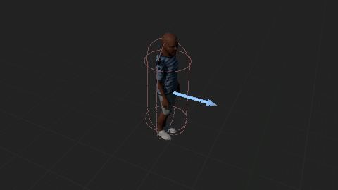                     |
| Tree                | Finds a tree in fron of the ego vehicle (if present, as a RepSpline blueprint, which is an Instanced Static Mesh) and makes it fall on the road                                            | Empty                                                                                                                                              | 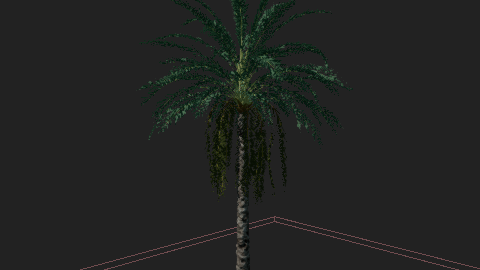                         |
| Bouncing Basketball | Spawns a basketball of the right of the ego vehicle at a certain height and makes it bounce on the road                                                                                    | Empty                                                                                                                                              |     |
| Bouncing Football   | Spawns a football of the right of the ego vehicle at a certain height and makes it bounce on the road                                                                                      | Empty                                                                                                                                              |         |
| Street Light        | Finds a street light in front of the ego vehicle (if present) and makes it fall on the road                                                                                                | Since the anomaly is locally attached to the street light, we need to keep updating is position                                                    | 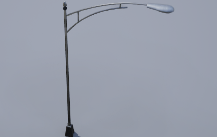          |
| Trash Can           | Spawn a Trash Can on the sidewalk and applies an impulse to make it fall on the road                                                                                                       | Empty                                                                                                                                              | 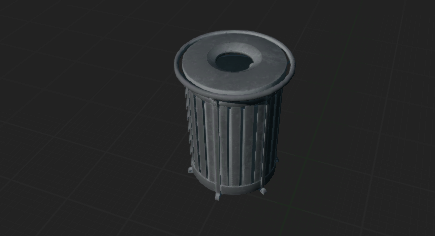                |
| Traffic Light       | Finds a traffic light in front of the ego vehicle (if present) and makes it fall on the road                                                                                               | Since the anomaly is locally attached to the traffic light, we need to keep updating is position                                                   | 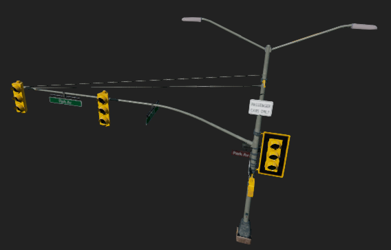        |
| Instant Car Break   | Finds a vehicle in front of the ego vehicle (if present, otherwise it's spawned) and attaches the anomaly to it                                                                            | After a certain amout of time, the car in front of the ego vehicle will instantly brake                                                            | N/A                                              |
| Traffic Light Off   | Finds a traffic light in front of the ego vehicle (if present) (not the one the ego vehicles is facing) and turns it off                                                                   | If the traffic light is off, the vehicles will not stop, so mark the vehicles in the intersection as "Dynamic_Anomaly"                             | 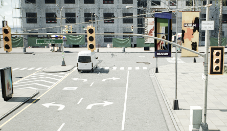 |
| Car Through Red     | Finds a traffic light in front of the ego vehicle (if present) (not the one the ego vehicles is facing) and makes a car (if present) ignore lights                                         | If the car is going through a red light, mark it as "Dynamic_Anomaly"                                                                              | N/A                                              |
| Garbage Bag Wind    | Spawn a garbage bag on the sidewalk and applies a small impulse to make it fly over the road                                                                                               | Keeps applying a small force to simulate the wind                                                                                                  | 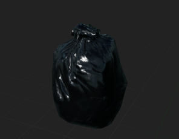   |
| Newspaper Wind      | Spawn a newspaper in front of the ego vehicle and applies a small impulse to make it fly over the road                                                                                     | Keeps applying a small force to simulate the wind                                                                                                  | 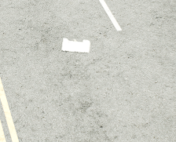   |
| Crash               | Finds a vehicle (target vehicle) in front of the ego vehicle (if present, otherwise it's spawned) and makes it ignore another vehicle (other vehicle) (if present, otherwise it's spawned) | Based on the waypoints of the target and other vehicles, make the target vehicle change into the lane of the other vehicle and increase it's speed | 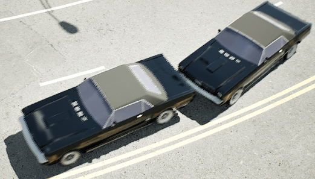                       |
| Bird                | Spawns a bird on the road that start flying once the vehicle is close to it                                                                                                                | Gets a random direction in a certain box area and flies to it                                                                                      | 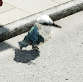                         |
| Danger Driver       | Finds a vehicle (target vehicle) in front of the ego vehicle (if present, otherwise it's spawned) and makes it drive dangerously, may ignore other vehicles, traffic lights, traffic signs | Based on a random choice, the target vehicle may change lane, ignoring potential issues                                                            | N/A                                              |
| Bill Board          | Finds a bill board in front of the ego vehicle (if present) and makes it fall                                                                                                              | Since the anomaly is locally attached to the bill board, we need to keep updating is position                                                      | 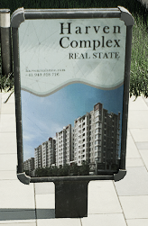              |
| Drone               | Spawns a drone that flies low in front of the ego vehicle                                                                                                                                  | Gets a random direction in a certain box area and flies to it                                                                                      | 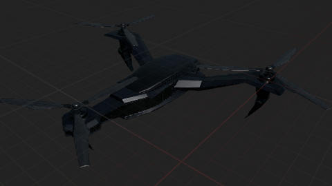                       |