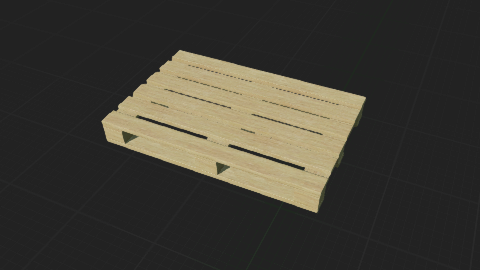
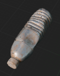
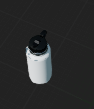
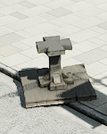
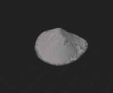
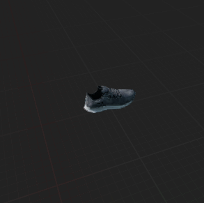
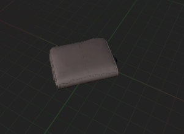
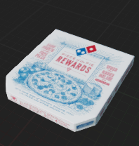

# Static Anomalies 
In this document, we will explore how to add a static anomaly in Carla Simulator and which anomalies are currently implemented.
## Adding a Static Anomaly
To add a static anomaly in Carla Simulator, you need to follow these steps:
1. **Find the static mesh of the anomaly**: You can create your own static mesh using 3D modeling software like Blender or download one from online repositories, such as Sketchfab.
2. **Check dimensions/location**: Ensure that the dimensions and location of the static mesh are appropriate for your simulation environment. Open blender and import the mesh to verify its size and position.
This is very important, as an incorrectly sized or positioned mesh can lead to unrealistic simulations.
3. **Import the mesh into Carla**: Once you have verified the mesh, go to _/Game/Carla/Static/_ and add the mesh to the correct folder.
Note that mesh's semantic label depends on the folder you place it in. For example, if you place it in the _Car_ folder, it will be labeled as a car.
4. **Create a blueprint for the anomaly**: In _/Game/Carla/Blueprints/_ create a new blueprint for your static anomaly. The blueprints that are already implemented can be found in _/Game/Carla/Blueprints/Props/_.
The parent blueprint can be _Actor_, I've created an _AnomalyMaster_ blueprint that inherits from _Actor_ and then all the anomalies inherit from _AnomalyMaster_, but you can also inherit directly from _Actor_.
5. **Set the static mesh to the blueprint**: Open the blueprint you created and set the static mesh to the one you imported in step 3. Also adjust some parameters, such as
Simulate Physics, Mass, Collisions, etc.
6. **Add the blueprint to the Blueprint Factory**: To make the anomaly spawnable for Python API, you need to add the blueprint to the Blueprint Factory.
Go to the _/Unreal/CarlaUnreal/Content/Carla/Config/BlueprintParameters.json_ file and add your blueprint to the list of spawnable blueprints. The list should look like this:
```json
{
    "Name":"Drone",
    "Path":"/Game/Carla/Blueprints/Props/Dynamic/Drone/BP_Drone.BP_Drone_C"
}
```
Where Drone is the name of the blueprint and the path is the path to the blueprint *CLASS* in the Unreal Engine project. Make sure to include the _C at the end of the path.
7. **Spawn it**: Now you can spawn the static anomaly using the Python API. The name of the Actor will be the same as the one you put in the JSON file (lowercase).
```python
anomaly_bp = world.get_blueprint_library().find('drone')
# Some random transform
anomaly_transform = carla.Transform(carla.Location(x=10, y=20, z=0), carla.Rotation(yaw=0))
anomaly = world.spawn_actor(anomaly_bp, anomaly_transform)
```

## Implementing Anomalies in Code
In mine implementation, each anomaly is represented by a class that inherits from a base class called `Anomaly`. There are two main methods for each anomaly class:
- `handle_semantic_tag()`: This method is responsible for handling the semantic tag of the anomaly. It can modify the semantic tag based on certain conditions or rules.
- `spawn_anomaly()`: This method is responsible for spawning the anomaly in the simulation. It takes care of setting the correct transform, adding the anomaly to the world, and any other necessary setup.
The spawn_anomaly method is based mainly on the `spawn_anomaly()` method from the _utils.py_ file. This method spawns the anomaly randomly in front
of the ego vehicle within a certain distance range (set to be between 10 and 20 meters). When spawning an anomaly a number of rays are cast in the (0,0,-1) direction (ground direction) in order to see if 
the anomaly is going to spawn above other objects. If so, the location is changed. This process is repeated until a valid location is found.
The number of rays depends on the area of the bounding box of the anomaly. 
Another things that I've implemented is the ability to spawn rotated objects. When spawning an object that can be rotated randomly, it needs to spawn a bit higher in order to avoid collisions with the ground.
So I've decided to spawn it at an high z location, such as 10 meters, then compute the min vertex of the bounding box and finally cast a ray to the ground (since this process is done after the valid location is
found, the ray should hit the ground). The final z location is computed as:
```python
final_z = original_location.z - (min_vertex_extent_z - ground_z) + 0.15
```
The 0.15 is added to avoid spawning the anomaly too close to the ground.

You can modify this method to spawn the anomaly in a different way if needed. There are five parameters:
  - is_dynamic: used for dynamic anomalies
  - is_character: used for character anomalies
  - can_be_rotated: this makes the anomaly randomly rotate in the three axis (roll,pitch,yaw)
  - anomaly_in_waypoint: if True spawns the anomaly on the sidewalk
  - spawn_at_zero: if True spawns the anomaly at the (0,0,0) location
  - spawn_on_right: if True spawns the anomaly on the right side of the ego vehicle
## Currently Implemented Static Anomalies
Here's a list of the already implemented static anomalies in Carla Simulator. For each anomaly there is a brief description of its spawn method/parameters, 
the handle_semantic_tag method (that in case of static anomalies is usually empty) and a picture.
The total number of static anomalies up to now is 79.

| Anomaly             | Spawn Method/Parameters                                                                                                                                                                                           | Handle Semantic Tag | Picture                                                |
|---------------------|-------------------------------------------------------------------------------------------------------------------------------------------------------------------------------------------------------------------|---------------------|--------------------------------------------------------|
| Baseballbat         | Spawns in front of the ego vehicle, can be rotated                                                                                                                                                                | Empty               |                  |
| Basketball          | Spawns in front of the ego vehicle, can be rotated                                                                                                                                                                | Empty               |                    |
| Football            | Spawns in front of the ego vehicle, can be rotated                                                                                                                                                                | Empty               |                        |
| Ladder              | Spawns in front of the ego vehicle, can be rotated                                                                                                                                                                | Empty               |                            |
| Mattress            | Spawns on the right of the ego vehicle                                                                                                                                                                            | Empty               |                        |
| Skateboard          | Spawns in front of the ego vehicle, can be rotated                                                                                                                                                                | Empty               |                    |
| Tire                | Spawns in front of the ego vehicle, can be rotated                                                                                                                                                                | Empty               |                                |
| WoodPalette         | Spawns in front of the ego vehicle                                                                                                                                                                                | Empty               |                  |
| FlippedCar          | Spawns a vehicle in front of the ego vehicle. Then the vehicle is rotated upside-down. The ego vehicle will ignore this vehicle and crash into it                                                                 | Empty               |                    |
| RoadSignTwisted     | Takes a road sign (if exists) in front of the ego vehicle and twists it. This is handled at both python and blueprint level                                                                                       | Empty               |          |
| RoadSignVandalized  | Takes a road sign (if exists) in front of the ego vehicle, make it invisible and move it away. Then spawns a vandalized road sign (Only stop signs up to now). This is handled at both python and blueprint level | Empty               |    |
| GarbageBag          | Spawns on the right of the ego vehicle                                                                                                                                                                            | Empty               |                   |
| BrokenChair         | Spawns in front of the ego vehicle, can be rotated                                                                                                                                                                | Empty               |                  |
| Bikes               | Spawns on the right of the ego vehicle                                                                                                                                                                            | Empty               |                              |
| Hubcap              | Spawns in front of the ego vehicle, can be rotated                                                                                                                                                                | Empty               |                            |
| Newspaper           | Spawns in front of the ego vehicle                                                                                                                                                                                | Empty               |                      |
| Box                 | Spawns on the right of the ego vehicle                                                                                                                                                                            | Empty               |                                  |
| PlasticBottle       | Spawns in front of the ego vehicle, can be rotated                                                                                                                                                                | Empty               |              |
| WineBottle          | Spawns on the right of the ego vehicle                                                                                                                                                                            | Empty               |                    |
| MetalBottle         | Spawns in front of the ego vehicle, can be rotated                                                                                                                                                                | Empty               |                  |
| Table               | Spawns on the right of the ego vehicle, can be rotated                                                                                                                                                            | Empty               |                              |
| OfficeChair         | Spawns on the right of the ego vehicle, can be rotated                                                                                                                                                            | Empty               |                  |
| OldStove            | Spawns on the right of the ego vehicle                                                                                                                                                                            | Empty               |                        |
| ShoppingCart        | Spawns on the right of the ego vehicle                                                                                                                                                                            | Empty               |                |
| Bag                 | Spawns in front of the ego vehicle, can be rotated                                                                                                                                                                | Empty               |                                  |
| Helmet              | Spawns in front of the ego vehicle, can be rotated                                                                                                                                                                | Empty               |                            |
| Hat                 | Spawns in front of the ego vehicle, can be rotated                                                                                                                                                                | Empty               |                                  |
| TrafficCone         | Spawns in front of the ego vehicle, can be rotated                                                                                                                                                                | Empty               |                  |
| FallenStreetLight   | Takes a street light (if exists) in front of the ego vehicle and change is position to make it look fallen. This is handled at blueprint level by setting the pitch to 90 or -90 degrees. Yaw is randomized       | Empty               |      |
| Book                | Spawns in front of the ego vehicle                                                                                                                                                                                | Empty               |                                |
| Stroller            | Spawns on the right of the ego vehicle, can be rotated                                                                                                                                                            | Empty               |                        |
| FuelCan             | Spawns in front of the ego vehicle, can be rotated                                                                                                                                                                | Empty               |                          |
| ConstructionBarrier | Spawns on the right of the ego vehicle, can be rotated                                                                                                                                                            | Empty               |  |
| Suitcase            | Spawns in front of the ego vehicle, can be rotated                                                                                                                                                                | Empty               |                        |
| CarMirror           | Spawns in front of the ego vehicle, can be rotated                                                                                                                                                                | Empty               |                      |
| Umbrella            | Spawns in front of the ego vehicle, can be rotated                                                                                                                                                                | Empty               |                        |
| TierScooter         | Spawns on the right of the ego vehicle, can be rotated                                                                                                                                                            | Empty               |                  |
| Scooter             | Spawns on the right of the ego vehicle, can be rotated                                                                                                                                                            | Empty               |                          |
| Brick               | Spawns on the right of the ego vehicle                                                                                                                                                                            | Empty               |                              |
| CarDoor             | Spawns in front of the ego vehicle, can be rotated                                                                                                                                                                | Empty               |                          |
| Mannequin           | Spawns in front of the ego vehicle, can be rotated                                                                                                                                                                | Empty               |                      |
| Rock                | Spawns in front of the ego vehicle, can be rotated                                                                                                                                                                | Empty               |                                |
| KidToy              | Spawns in front of the ego vehicle, can be rotated                                                                                                                                                                | Empty               |                            |
| TrunkCar            | Spawns in front of the ego vehicle, can be rotated                                                                                                                                                                | Empty               |                        |
| HoodCar             | Spawns in front of the ego vehicle, can be rotated                                                                                                                                                                | Empty               |                          |
| Tablet              | Spawns in front of the ego vehicle, can be rotated                                                                                                                                                                | Empty               |                            |
| Smartphone          | Spawns in front of the ego vehicle, can be rotated                                                                                                                                                                | Empty               |                    |
| Laptop              | Spawns in front of the ego vehicle, can be rotated                                                                                                                                                                | Empty               |                            |
| Beer Bottle         | Spawns in front of the ego vehicle, can be rotated                                                                                                                                                                | Empty               |                          |
| Television          | Spawns on the right of the ego vehicle, can be rotated                                                                                                                                                            | Empty               |                    |
| WashingMachine      | Spawns on the right of the ego vehicle, can be rotated                                                                                                                                                            | Empty               |            |
| Fridge              | Spawns on the right of the ego vehicle, can be rotated                                                                                                                                                            | Empty               |                            |
| Pile Sand           | Spawns on the right of the ego vehicle                                                                                                                                                                            | Empty               |                        |
| Shovel              | Spawns in front of the ego vehicle, can be rotated                                                                                                                                                                | Empty               |                            |
| Rake                | Spawns in front of the ego vehicle, can be rotated                                                                                                                                                                | Empty               |                                |
| Delivery Box        | Spawns in front of the ego vehicle, can be rotated                                                                                                                                                                | Empty               |                  |
| Fallen Tree         | Takes a tree (if exists) in front of the ego vehicle and change is position to make it look fallen. This is handled at blueprint level by setting the pitch to 90 or -90 degrees. Yaw is randomized               | Empty               |                    |
| Oven                | Spawns on the right of the ego vehicle, can be rotated                                                                                                                                                            | Empty               |                                |
| Wheelchair          | Spawns on the right of the ego vehicle, can be rotated                                                                                                                                                            | Empty               |                    |
| Shoe                | Spawns in front of the ego vehicle, can be rotated                                                                                                                                                                | Empty               |                                |
| Hammer              | Spawns in front of the ego vehicle, can be rotated                                                                                                                                                                | Empty               |                            |
| Wrench              | Spawns in front of the ego vehicle, can be rotated                                                                                                                                                                | Empty               |                            |
| Glove               | Spawns in front of the ego vehicle, can be rotated                                                                                                                                                                | Empty               |                              |
| Drill               | Spawns in front of the ego vehicle, can be rotated                                                                                                                                                                | Empty               |                              |
| Saw                 | Spawns in front of the ego vehicle, can be rotated                                                                                                                                                                | Empty               |                                  |
| Sun Glasses         | Spawns in front of the ego vehicle, can be rotated                                                                                                                                                                | Empty               |                    |
| Wallet              | Spawns in front of the ego vehicle, can be rotated                                                                                                                                                                | Empty               |                            |
| Coffe Cup           | Spawns in front of the ego vehicle, can be rotated                                                                                                                                                                | Empty               |                       |
| Fence               | Spawns on the right of the ego vehicle, can be rotated                                                                                                                                                            | Empty               |                              |
| Pizza Box           | Spawns in front of the ego vehicle, can be rotated                                                                                                                                                                | Empty               |                        |
| Toy Car             | Spawns in front of the ego vehicle, can be rotated                                                                                                                                                                | Empty               |                            |
| Remote Control      | Spawns in front of the ego vehicle, can be rotated                                                                                                                                                                | Empty               |              |
| CD                  | Spawns in front of the ego vehicle, can be rotated                                                                                                                                                                | Empty               |                                    |
| Power Bank          | Spawns in front of the ego vehicle, can be rotated                                                                                                                                                                | Empty               |                      |
| Deodorant           | Spawns in front of the ego vehicle, can be rotated                                                                                                                                                                | Empty               |                      |
| Lighter             | Spawns in front of the ego vehicle, can be rotated                                                                                                                                                                | Empty               |                          |
| Bowl                | Spawns in front of the ego vehicle, can be rotated                                                                                                                                                                | Empty               |                                |
| Bucket              | Spawns in front of the ego vehicle, can be rotated                                                                                                                                                                | Empty               |                            |
| Speaker             | Spawns in front of the ego vehicle, can be rotated                                                                                                                                                                | Empty               |                          |